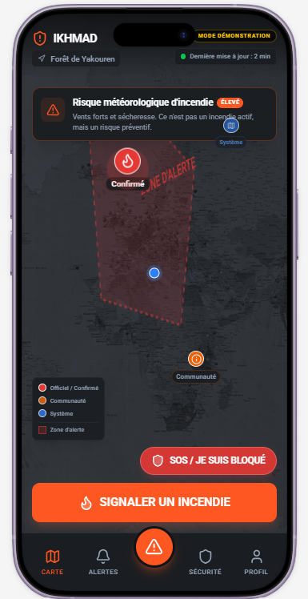
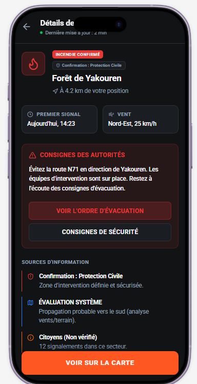
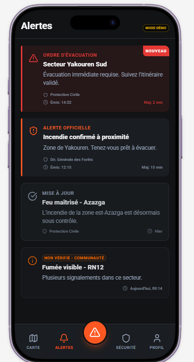
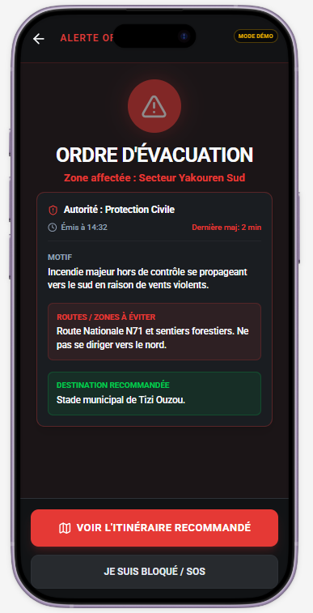
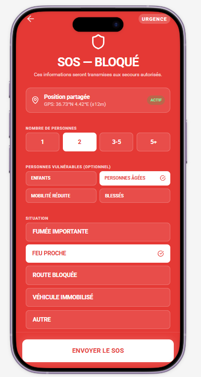
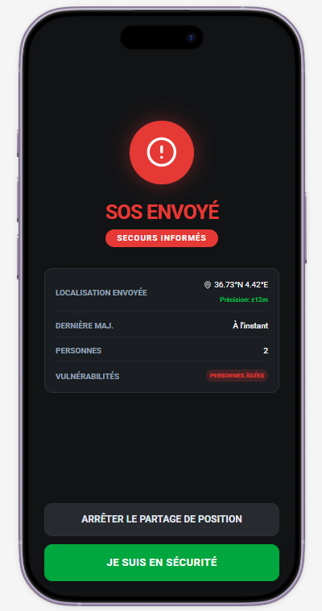
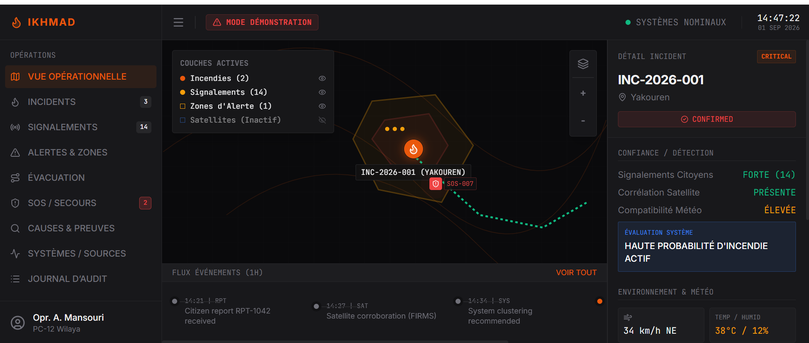
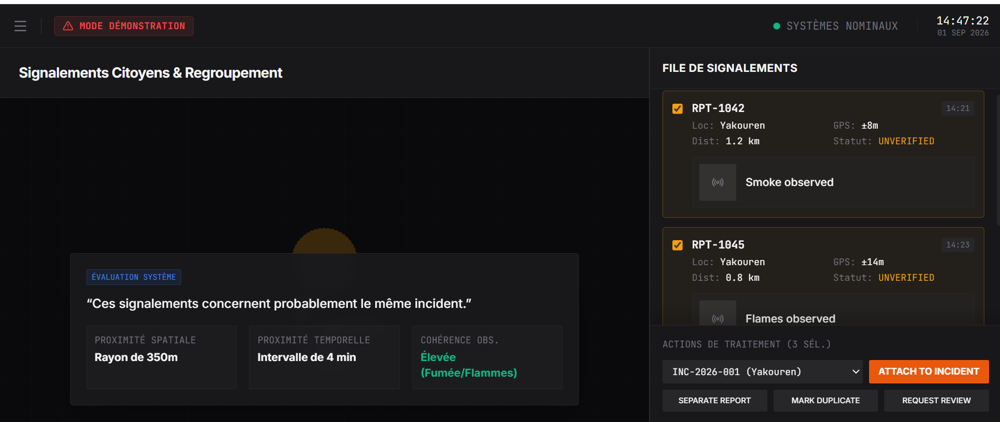
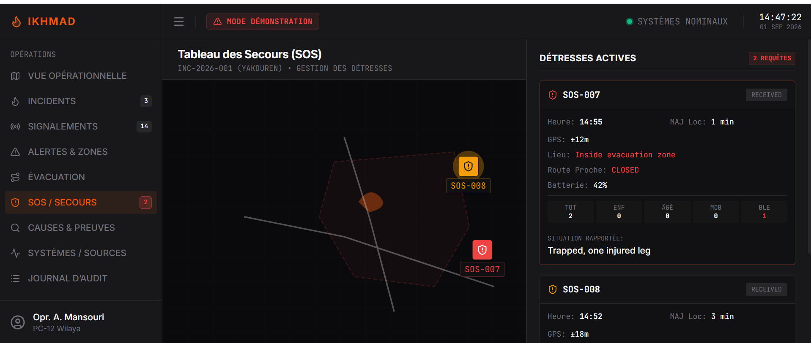

# IKHMAD | إخماد

<div align="center">

### Wildfire Intelligence, Coordination & Evacuation Platform

**From early reporting to coordinated evacuation — one shared operational picture for citizens and responders.**

**Current stage:** High-fidelity interactive prototype · Pre-MVP

</div>

---

## 🌲 The Challenge

Wildfires evolve quickly. Information can arrive from different sources at different times, while citizens need clear guidance and emergency operators need a reliable operational picture.

IKHMAD is designed to connect citizen observations, professional incident review, geospatial information, alerts, SOS, evacuation workflows and future decision-support services.

> **IKHMAD does not replace official emergency services.** It is designed as a digital coordination and decision-support layer supporting authorized emergency actors and the public.

## 🛡️ The Platform

```text
Detection
   ↓
Citizen / External Reporting
   ↓
Correlation & Verification
   ↓
Incident Assessment
   ↓
Alerting
   ↓
Evacuation Decision Support
   ↓
Safe Route / Safe-Zone Guidance
   ↓
Continuous Reassessment
```

IKHMAD has two complementary interfaces: a **citizen mobile application** and a **professional command-center dashboard**.

## 📱 Citizen Experience

### Wildfire situational awareness

The map distinguishes official/confirmed incidents, community information and system information while presenting relevant risk context.

<p align="center">
  
  &nbsp;&nbsp;
  
</p>

The incident view makes **source provenance explicit**: professional confirmation, system assessment and unverified citizen observations are distinct.

### Citizen reporting

Citizen observations enter an analysis/review workflow rather than automatically becoming confirmed incidents.

<p align="center">
  
</p>

### Alerts & evacuation

IKHMAD is designed to connect incident information to actionable safety guidance.

<p align="center">
  
  &nbsp;&nbsp;
  
</p>

The prototype demonstrates differentiated alert states, official evacuation instructions, routes/zones to avoid and recommended safe destinations.

### SOS / distress assistance

<p align="center">
  
  &nbsp;&nbsp;
  
</p>

The SOS experience can communicate location, number of persons, vulnerability information and emergency context.

## 🖥️ Command-Center Experience

### Operational picture

<p align="center">
  
</p>

The command center brings incidents, citizen reports, alert zones, source information and operational context into a shared geospatial view.

### Report correlation & review

<p align="center">
  
</p>

The public prototype illustrates spatial proximity, temporal proximity and observation consistency. The proprietary correlation/confidence implementation is **not published here**.

### SOS management

<p align="center">
  
</p>

```text
CITIZEN                              COMMAND CENTER

Report fire  ──────────────────────► Incoming report
                                         ↓
                                  Review / correlation
                                         ↓
                                  Incident validation
                                         │
Alert / guidance ◄───────────────────────┘

SOS + location ────────────────────► Distress dashboard
```

## 🧠 IKHMAD Intelligence Layer

Planned inputs include citizen reports, professional inputs, satellite/sensor observations, weather/terrain information and road/GIS data.

The proprietary intelligence layer is intended to support:

- multi-source incident correlation;
- source provenance and confidence assessment;
- dynamic hazard evaluation;
- risk-aware evacuation support;
- route-safety evaluation;
- safe-zone evaluation;
- event-driven reassessment as conditions change.

### 🔒 Proprietary technology boundary

This public repository intentionally does **not** publish:

- exact confidence formulas;
- calibrated source-reliability rules;
- operational thresholds;
- hazard-prediction internals;
- predictive route-scoring algorithms;
- future-road traversability calculations;
- safe-zone ranking formulas;
- anti-fraud / false-report models;
- calibration datasets;
- unreleased patent-sensitive mechanisms.

See [`docs/IP_BOUNDARY.md`](docs/IP_BOUNDARY.md).

## 🏗️ Public Architecture

```text
 Citizens                           Emergency Operators
    │                                      │
    ▼                                      ▼
Mobile Application                 Command Dashboard
      \                                  /
       \                                /
              IKHMAD API Layer
                     │
       ┌─────────────┼─────────────┐
       ▼             ▼             ▼
   Incidents       Alerts          SOS
       │
       ▼
┌───────────────────────────────────────────┐
│          IKHMAD INTELLIGENCE LAYER       │
│              Proprietary Core            │
└───────────────────────────────────────────┘
       │
       ├──────────────┬──────────────┐
       ▼              ▼              ▼
  Geospatial       Routing       Safe Zones
   Services        Interface      Interface
       │
       ▼
    Data Layer
       │
 GIS · Weather · Satellite · Roads · External Sources
```

This defines the current **public system boundary**, not a claim that every service is already operational.

See [`docs/ARCHITECTURE.md`](docs/ARCHITECTURE.md).

## 🧪 Current Prototype

**Demonstrated**

- ✅ Citizen mobile UX
- ✅ Command-center UX
- ✅ Wildfire map and incident details
- ✅ Citizen fire-reporting workflow
- ✅ Report review / correlation concept
- ✅ Incident validation workflow
- ✅ Alert workflow
- ✅ Evacuation-order workflow
- ✅ SOS workflow
- ✅ Professional SOS monitoring
- ✅ Dynamic evacuation/rerouting product concept

**Planned production capability**

- ⏳ Production authentication and authorization
- ⏳ Persistent operational backend
- ⏳ Real-time mobile ↔ command-center synchronization
- ⏳ Production GIS infrastructure
- ⏳ Operational external-data integrations
- ⏳ Validated multi-source intelligence engine
- ⏳ Predictive wildfire/hazard model
- ⏳ Production risk-aware routing
- ⏳ Institutional field validation

The prototype demonstrates **intended system behavior and user workflows**. Simulated behavior must not be interpreted as a deployed emergency capability.

## 🔌 Public API Direction

The preliminary public API contract includes interfaces such as:

```text
POST /api/v1/incidents
GET  /api/v1/incidents/{id}
POST /api/v1/sos
GET  /api/v1/alerts
GET  /api/v1/hazards
POST /api/v1/routes/evaluate
GET  /api/v1/safe-zones
```

See [`api/openapi-public.yaml`](api/openapi-public.yaml) and synthetic examples in [`examples/`](examples/).

## 🚀 Development Roadmap

| Phase | Objective | Status |
|---|---|---|
| **0 — Product Prototype** | Citizen + command-center workflows | ✅ Prototype |
| **1 — Connected MVP** | Backend, persistence, realtime incidents, alerts & SOS | ⏳ Planned |
| **2 — Incident Intelligence** | External data, GIS, correlation & confidence services | ⏳ Planned |
| **3 — Predictive Evacuation** | Hazard-aware routing, safe-zone evaluation & reassessment | ⏳ Planned |
| **4 — Institutional Pilot** | Controlled pilot, simulation and field validation | ⏳ Planned |
| **5 — Scale** | Multi-region deployment and institutional integrations | ⏳ Planned |

Full roadmap: [`docs/ROADMAP.md`](docs/ROADMAP.md).

## 🔐 Intellectual-Property Strategy

IKHMAD uses a layered approach:

- **Public architecture/interfaces** communicate the product and integration boundaries.
- **Copyright** protects original software, documentation and project assets.
- **Confidential know-how / trade secrets** can protect calibrated models, thresholds and selected decision logic.
- **Patent assessment** may cover selected technical mechanisms before detailed public disclosure.
- **Brand protection** may separately cover IKHMAD / إخماد and associated brand assets.

See [`COPYRIGHT.md`](COPYRIGHT.md) and [`docs/IP_BOUNDARY.md`](docs/IP_BOUNDARY.md).

## 🛡️ Security & Privacy

IKHMAD's design principles include data minimization, controlled operator access, auditability, secure communications, source provenance and protection of sensitive location information.

Never commit real citizen emergency data, credentials, private keys or production secrets to this public repository.

See [`SECURITY.md`](SECURITY.md) and [`docs/SECURITY_PRIVACY.md`](docs/SECURITY_PRIVACY.md).

## 📚 Documentation

| Document | Purpose |
|---|---|
| [`Product Overview`](docs/PRODUCT_OVERVIEW.md) | Product vision and users |
| [`Architecture`](docs/ARCHITECTURE.md) | Public system architecture |
| [`Citizen Workflow`](docs/CITIZEN_WORKFLOW.md) | Citizen-side journeys |
| [`Command Center Workflow`](docs/COMMAND_CENTER_WORKFLOW.md) | Professional workflows |
| [`Incident Lifecycle`](docs/INCIDENT_LIFECYCLE.md) | Incident states |
| [`Evacuation Overview`](docs/EVACUATION_OVERVIEW.md) | Public evacuation architecture |
| [`Data Sources`](docs/DATA_SOURCES.md) | Planned data categories |
| [`Security & Privacy`](docs/SECURITY_PRIVACY.md) | Security principles |
| [`IP Boundary`](docs/IP_BOUNDARY.md) | Public vs proprietary technology |
| [`Roadmap`](docs/ROADMAP.md) | Development phases |
| [`Public API`](api/openapi-public.yaml) | Preliminary API contract |

## ⚠️ Prototype Disclaimer

IKHMAD is currently under development. Screens, scenarios, incident identifiers, locations, system assessments and operational workflows shown in this repository may contain **demonstration or synthetic data**. They must not be interpreted as real emergency information or instructions from public authorities.

In a real emergency, users must follow instructions issued by authorized emergency services and competent public authorities.

---

<div align="center">

## IKHMAD | إخماد

**Protecting forests. Supporting safer decisions.**

Prototype · 2026

Copyright © 2026 IKHMAD. All rights reserved.

</div>
